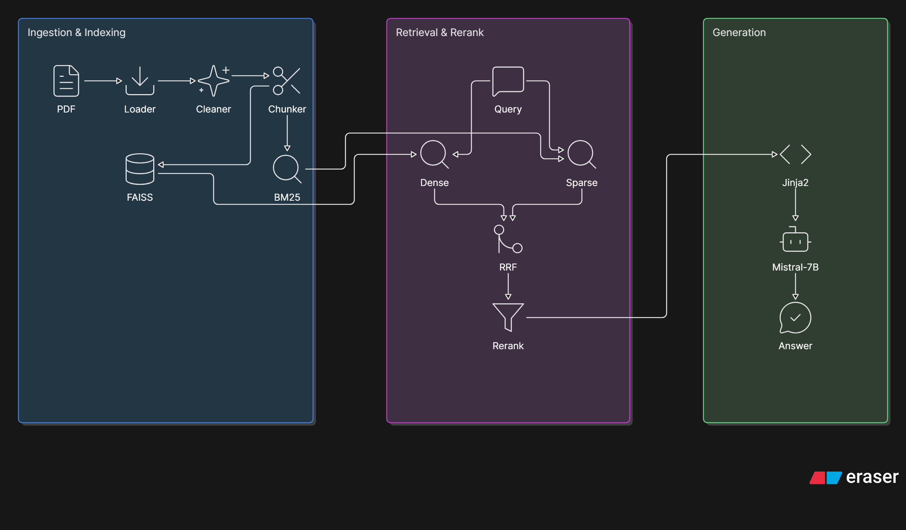

# veridoc

A RAG pipeline with an automated evaluation framework.

Not just a RAG system a system that measures whether its own retrieval is grounded.

---

## What it does

Upload a PDF. Ask a question. veridoc retrieves the most relevant chunks using hybrid search, reranks them with a cross-encoder, generates a grounded answer using a local LLM, and tells you exactly which page and file the answer came from.

The evaluation framework generates synthetic test questions, runs them through the pipeline, and scores answers automatically using RAGAS metrics, no manual review needed.

---

## Architecture


---

## Stack

- **Embeddings:** sentence-transformers (all-MiniLM-L6-v2)
- **Dense retrieval:** FAISS IndexFlatL2
- **Sparse retrieval:** BM25 (rank-bm25)
- **Fusion:** Reciprocal Rank Fusion
- **Reranker:** cross-encoder/ms-marco-TinyBERT-L-2-v2
- **LLM:** Mistral-7B via Ollama (local) / Groq API (production)
- **Evaluation:** RAGAS + MLflow
- **UI:** Gradio

---

## Baseline Eval Results

| Metric | Score |
|--------|-------|
| Faithfulness | 1.00 |
| Answer Relevancy | 0.89 |
| Context Recall | 1.00 |
| Context Precision | 1.00 |

See full ablation results in [reports/ablation_report.md](reports/ablation_report.md)

---

## Run locally

```bash
git clone https://github.com/YOURUSERNAME/veridoc
cd veridoc
python -m venv .venv
.venv\Scripts\activate
pip install -r requirements.txt
ollama pull mistral
python app.py
```

---

## Decisions

Every architectural choice documented in [decisions.md](decisions.md).